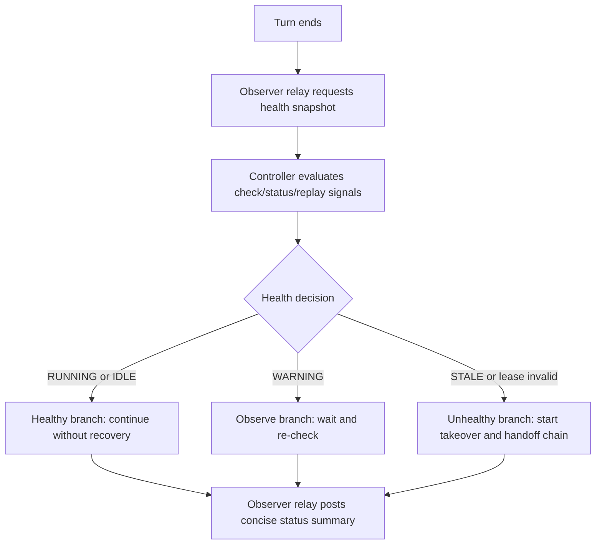
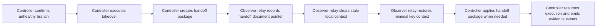

# Multi-Agent Collaboration Workflow (Observer Relay)

Language: **English** | [中文](multi-agent-collaboration.zh-CN.md)

## 1. Goal and Scope

This document defines the bilingual reference workflow for observer-relay collaboration.
It covers the full recovery chain required by DKT-026:

1. End-of-turn health-check decision branching.
2. Handoff trigger on unhealthy conditions.
3. Relay-context clear after handoff data is persisted.
4. Restore of minimal key context before resuming execution.

## 2. Role Boundary: Observer Relay vs Controller

| Capability | Observer Relay (External Window) | Controller (Subagent Lane) |
| --- | --- | --- |
| User instruction handling | Forward input and show state summaries | Own execution routing and acceptance decisions |
| Health signals (`check/status/replay`) | Read and present to user | Evaluate signals and decide branch |
| Takeover and handoff actions | Must not decide or execute ownership changes | Executes `takeover`, `handoff --create`, and `handoff --apply` as needed |
| Context clear | Clear local relay context only after handoff pointer exists | Ensure handoff data exists before relay clear |
| Context restore | Restore `goal`, `constraints`, `latest_instruction`, `current_blockers`, `controller_route_summary` | Validate restored state and continue run |

## 3. Workflow A: Health-Check Decision Branch



## 4. Workflow B: Handoff -> Clear -> Restore Chain



## 5. Recovery Procedure (Step by Step)

1. Controller collects health signals:
   ```bash
   PYTHONPATH=src python3 -m cli check --root .
   PYTHONPATH=src python3 -m cli status --root . --task-id <TASK_ID> --run-id <RUN_ID> --json
   PYTHONPATH=src python3 -m cli replay --root . --source events --limit 20
   ```
2. Controller decides branch:
   - `RUNNING` or `IDLE`: stay on healthy branch, no recovery action.
   - `WARNING`: stay in observe mode and re-check shortly.
   - `STALE` or invalid lease: enter recovery chain.
3. Controller takes ownership:
   ```bash
   PYTHONPATH=src python3 -m cli takeover \
     --root . \
     --task-id <TASK_ID> \
     --run-id <RUN_ID> \
     --successor-thread-id <THREAD_ID> \
     --successor-pid <SUCCESSOR_PID>
   ```
4. Controller captures handoff package:
   ```bash
   PYTHONPATH=src python3 -m cli handoff --root . --create
   ```
5. Observer relay records handoff pointer and run identifiers, then clears stale local context.
6. Observer relay restores only the key context set:
   - `goal`
   - `constraints`
   - `latest_instruction`
   - `current_blockers`
   - `controller_route_summary`
7. Controller applies handoff package when recovery requires state hydration:
   ```bash
   PYTHONPATH=src python3 -m cli handoff --root . --apply
   ```
8. Controller resumes execution and observer relay reports current status:
   ```bash
   PYTHONPATH=src python3 -m cli run --root . --task-id <TASK_ID> --run-id <RUN_ID> --goal "<GOAL>"
   PYTHONPATH=src python3 -m cli status --root . --task-id <TASK_ID> --run-id <RUN_ID> --json
   ```
9. To run this recovery chain as one reproducible drill:
   ```bash
   bash examples/cli/observer_relay_recovery_chain.sh .
   ```

## 6. Compatibility Guardrails

- Do not rename CLI command names or argument names.
- Keep contract semantics compatible with `schema_version=1.0.0`.
- Keep `v1.0.0-rc1` anchor meaning and `docs/reports/final-run/` evidence structure unchanged.

## 7. Related Documents

- [Architecture overview](../architecture.md)
- [LangChain + LangGraph + RAG cooperation (English)](langchain-langgraph-rag-cooperation.en.md)
- [Codex integration runbook (English)](codex-integration-runbook.en.md)
- [CLI quickstart](../cli-quickstart.md)
- [Backend-to-agent workflows](../backend-to-agent-workflows.md)
- [Runnable observer-relay recovery-chain CLI example](../../examples/cli/observer_relay_recovery_chain.sh)
- [Runnable integrated reliability recovery-chain CLI example](../../examples/cli/integrated_reliability_recovery_chain.sh)
- [Chinese version of this workflow](multi-agent-collaboration.zh-CN.md)
