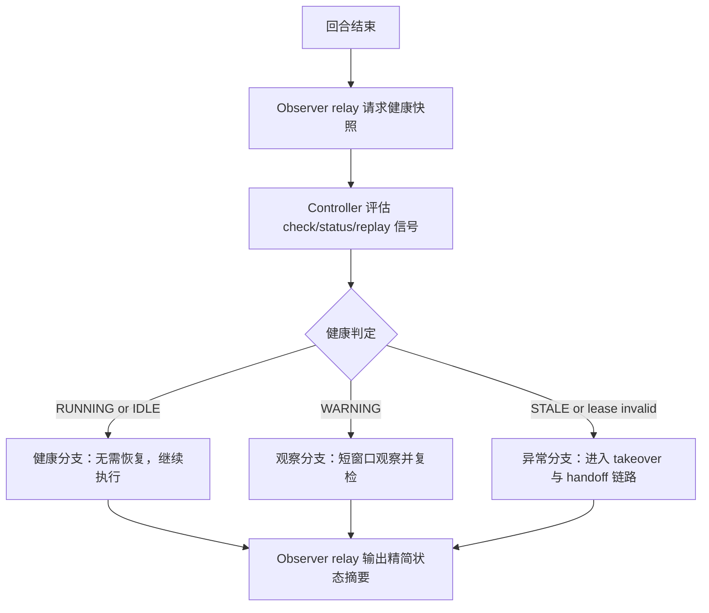
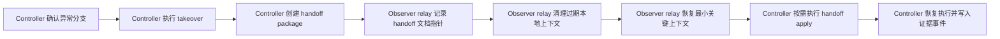

# 多 Agent 协作工作流（Observer Relay）

语言： [English](multi-agent-collaboration.en.md) | **中文**

## 1. 目标与范围

本文定义 observer-relay 协作模式的中英文镜像工作流，覆盖 DKT-026 要求的完整恢复链路：

1. 回合结束后的健康检查分支决策。
2. 在异常分支触发 handoff。
3. handoff 信息落盘后清理 relay 上下文。
4. 恢复最小关键上下文后继续执行。

## 2. 角色边界：Observer Relay 与 Controller

| 能力项 | Observer Relay（外部窗口） | Controller（Subagent Lane） |
| --- | --- | --- |
| 用户指令处理 | 转发输入并展示状态摘要 | 负责执行路由与验收决策 |
| 健康信号（`check/status/replay`） | 读取并回传给用户 | 评估信号并决定分支 |
| takeover 与 handoff 动作 | 不得决定或执行所有权变更 | 按需执行 `takeover`、`handoff --create`、`handoff --apply` |
| 上下文清理 | 仅在 handoff 指针存在后清理本地 relay 上下文 | 在 relay 清理前确保 handoff 数据可用 |
| 上下文恢复 | 仅恢复 `goal`、`constraints`、`latest_instruction`、`current_blockers`、`controller_route_summary` | 校验恢复状态并继续执行 |

## 3. 工作流 A：健康检查分支决策



## 4. 工作流 B：handoff -> clear -> restore 链路



## 5. 恢复流程（逐步）

1. Controller 收集健康信号：
   ```bash
   PYTHONPATH=src python3 -m cli check --root .
   PYTHONPATH=src python3 -m cli status --root . --task-id <TASK_ID> --run-id <RUN_ID> --json
   PYTHONPATH=src python3 -m cli replay --root . --source events --limit 20
   ```
2. Controller 判定分支：
   - `RUNNING` 或 `IDLE`：保持健康分支，不执行恢复动作。
   - `WARNING`：保持观察模式并短周期复检。
   - `STALE` 或 lease 无效：进入恢复链路。
3. Controller 接管所有权：
   ```bash
   PYTHONPATH=src python3 -m cli takeover \
     --root . \
     --task-id <TASK_ID> \
     --run-id <RUN_ID> \
     --successor-thread-id <THREAD_ID> \
     --successor-pid <SUCCESSOR_PID>
   ```
4. Controller 生成 handoff package：
   ```bash
   PYTHONPATH=src python3 -m cli handoff --root . --create
   ```
5. Observer relay 记录 handoff 指针与运行标识后，清理过期本地上下文。
6. Observer relay 仅恢复以下关键上下文：
   - `goal`
   - `constraints`
   - `latest_instruction`
   - `current_blockers`
   - `controller_route_summary`
7. 当恢复需要状态回填时，Controller 执行 handoff apply：
   ```bash
   PYTHONPATH=src python3 -m cli handoff --root . --apply
   ```
8. Controller 继续执行，Observer relay 回传最新状态：
   ```bash
   PYTHONPATH=src python3 -m cli run --root . --task-id <TASK_ID> --run-id <RUN_ID> --goal "<GOAL>"
   PYTHONPATH=src python3 -m cli status --root . --task-id <TASK_ID> --run-id <RUN_ID> --json
   ```
9. 若需一条命令跑完整恢复链演练：
   ```bash
   bash examples/cli/observer_relay_recovery_chain.sh .
   ```

## 6. 兼容性护栏

- 不修改 CLI 命令名与参数名。
- 保持与 `schema_version=1.0.0` 兼容的契约语义。
- 保持 `v1.0.0-rc1` 锚点语义与 `docs/reports/final-run/` 证据目录结构不变。

## 7. 相关文档

- [架构总览](../architecture.md)
- [CLI 快速上手](../cli-quickstart.md)
- [后端到 Agent 工作流](../backend-to-agent-workflows.md)
- [可运行 Observer-relay 恢复链 CLI 示例](../../examples/cli/observer_relay_recovery_chain.sh)
- [English version of this workflow](multi-agent-collaboration.en.md)
