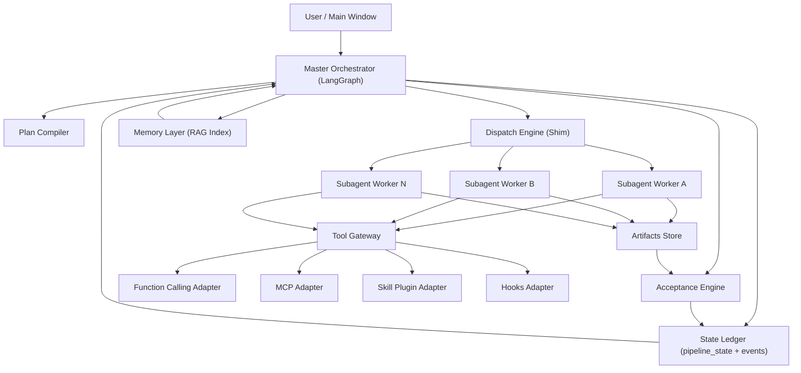
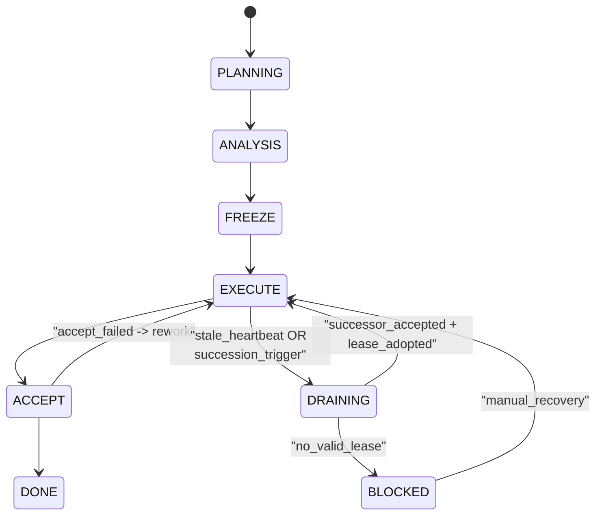
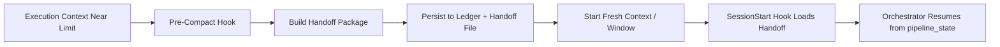

# DAOKit Architecture Design

## 1. Design Goals
1. Enforce orchestrator purity and deterministic governance.
2. Preserve execution continuity for long-running workflows.
3. Make every decision auditable and replayable.
4. Combine LangGraph + RAG + tool adapters without state ambiguity.

## 2. High-Level Architecture

## 3. Runtime State Machine

## 4. Core Components

### 4.1 Master Orchestrator (LangGraph)
- Graph nodes: `extract -> plan -> dispatch -> verify -> transition`.
- Only emits control actions; does not directly edit repo files.
- Uses state ledger snapshot as node input, never raw chat as authority.

### 4.2 Plan Compiler
- Converts requirements + constraints into step contracts.
- Normalizes each step to: `goal`, `actions`, `acceptance_criteria`, `expected_outputs`, `dependencies`.
- Produces deterministic `TASK_ID` and `RUN_ID`.

### 4.3 Dispatch Engine (Shim-based)
- Standard create/resume calls to local shim wrapper.
- Captures raw I/O, parsed output, and structured events.
- Supports rework loop with bounded retries.

### 4.4 Acceptance Engine
- Reads artifacts and compares against step acceptance criteria.
- Rejects mismatched scope or missing verification evidence.
- Emits rework payload for failed criteria (diff-oriented, not full reset).

### 4.5 State Ledger
- `pipeline_state.json`: single truth for task status and lifecycle.
- `events.jsonl`: append-only event timeline.
- `process_leases.json`: active ownership and takeover contract.
- `heartbeat_status.json`: liveness and stale decision record.

### 4.6 Memory Layer (RAG)
- Corpus: specs, design docs, troubleshooting records, accepted run artifacts.
- Retrieval strategy: task-id scoped first, then global fallback.
- Output includes source references and relevance score.
- RAG can advise planning/execution but cannot mutate ledger directly.

### 4.7 Tool Gateway
- Single interface for function calls, MCP tools, skill plugins, and hooks.
- Every tool invocation records request/response/status and step correlation ID.

## 5. Tool Abstraction Model

### Function Calling
- Best for deterministic operations with strict input schema.
- Required when action must be validated before invocation.

### MCP
- Best for external capabilities (docs/db/browser/custom service) discovered at runtime.
- Used when tool ownership is outside local process boundary.

### Skill Plugins
- Best for domain workflows and local script bundles.
- Encodes reusable playbooks and project conventions.

### Hooks
- Best for event interception and cross-cutting policy (pre-compact, pre-dispatch, post-accept).
- Must be idempotent and timeout-bounded.

## 6. Long-Run Continuity (Near-Lossless Core Rotation)

### Handoff Package Contract
- Required fields: `task_id`, `run_id`, `current_step`, `open_acceptance_items`, `evidence_paths`, `next_action`.
- Optional fields: recent decisions, unresolved blockers, retrieval cache keys.
- Validation: package hash + schema version.

## 7. Heartbeat and Lease Design

### Heartbeat
- Interval: 5m check cadence.
- Warning threshold: 15m silence.
- Stale threshold: 20m no output (`NO_OUTPUT_20M`).
- Signal sources: explicit beat + artifact mtime progression.

### Lease
- Fields: lane, step_id, task_id, run_id, thread_id, pid, lease_token, expiry, status.
- Actions: register, heartbeat, renew, release, takeover.
- Rule: only valid unexpired lease may preserve a running step during succession.

### Succession
- Triggered by stale hard-breach or health decision.
- First stale in one silence streak emits one escalation event (dedup key).
- Accepted successor adopts valid leases; non-adopted running steps become failed.

## 8. Data Contracts

### 8.1 `pipeline_state.json` (minimum)
- `task_id`, `goal`, `status`, `current_step`, `steps[]`, `role_lifecycle`, `succession`, `updated_at`.

### 8.2 Step Contract
- `id`, `title`, `category`, `goal`, `actions[]`, `acceptance_criteria[]`, `expected_outputs[]`, `dependencies[]`.

### 8.3 Evidence Contract
- `report.md`, `verification.log`, `audit-summary.md` (when acceptance gate configured).

## 9. Failure Handling
1. Missing evidence: mark step as failed and produce rework payload.
2. Out-of-scope file modifications: immediate rework.
3. Heartbeat stale: run health escalation and succession vote flow.
4. Lease adoption failure: running steps downgraded to failed; require explicit resume.

## 10. Security and Guardrails
- Command allowlist per step.
- Sensitive token/path redaction in logs.
- Immutable events append policy.
- Explicit versioning for contract changes.

## 11. Why This Design Fits DAOKit
- It keeps the orchestration model simple but strict.
- It supports fast vibe-coding loops without losing governance.
- It makes long tasks survivable by design, not by luck.

