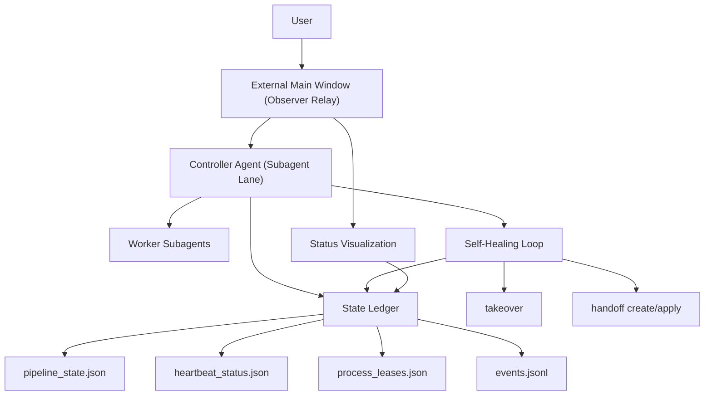
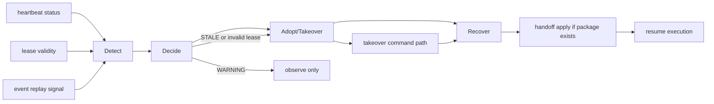

# Observer Relay and Bilingual Experience Design

## 1. Design Summary
This design introduces an observer-relay execution boundary for the external main window, moves controller authority fully into subagent chain semantics, and operationalizes self-healing as a deterministic loop using existing lease/heartbeat/handoff capabilities.

In parallel, this design introduces a bilingual documentation surface:
- pure English `README.md`
- pure Chinese `README.zh-CN.md`
- bilingual multi-agent collaboration workflow examples

The design is explicitly non-breaking for CLI argument names, contract version semantics (`1.0.0`), and release evidence layout under `docs/reports/final-run/`.

## 2. Architecture Mapping

## 3. Control and Data Boundaries

### 3.1 External Relay Responsibilities
- Forward user instructions to controller chain.
- Present status snapshots from ledger and health checks.
- Perform context compaction and stale-noise pruning.

### 3.2 External Relay Prohibitions
- No direct step execution.
- No direct task routing decisions.
- No direct ownership takeover.

### 3.3 Controller Ownership
- Controller lane owns execution routing and recovery decisions.
- Ownership persistence is represented by existing lease + lifecycle records.

## 4. Self-Healing Closed Loop Design

### Decision Rules
1. `WARNING`: hold and observe, no automatic ownership handover.
2. `STALE` or unrecoverable lease state: enter takeover path.
3. After takeover, recover via handoff package when available.
4. Emit only compatible event types; encode detail in payload, not enum expansion.

## 5. Compaction Policy Design

### Keep Set (must retain)
- User goal
- Constraints
- Latest instruction
- Current blockers
- Controller route summary

### Drop Set (must remove)
- Outdated execution logs
- Duplicate status reports
- Historical failure noise with no action value
- Irrelevant API error dumps

### Integration Point
Use existing lifecycle hook capability (`pre-compact`) to enforce keep/drop policy with idempotent behavior.

## 6. Compatibility Guardrails
1. CLI parser command and arg names unchanged.
2. No incompatible edits in current schemas (`pipeline_state`, `process_leases`, `heartbeat_status`, `events`).
3. Keep release evidence directory shape unchanged; only content updates allowed where needed.
4. Add rollback steps that can disable relay policy features without state migration break.

## 7. Bilingual Documentation Design

### 7.1 README Split
- `README.md`: English-only narrative.
- `README.zh-CN.md`: Chinese-only narrative.
- Both include a top-level language switch link to each other.

### 7.2 Bilingual Workflow Example
Add paired docs such as:
- `docs/workflows/multi-agent-collaboration.en.md`
- `docs/workflows/multi-agent-collaboration.zh-CN.md`

Required flow coverage:
1. End-of-turn health check.
2. Healthy branch: no action.
3. Unhealthy branch: trigger window handoff.
4. Trigger context clear.
5. Restore key context from handoff document.

### 7.3 Optional Runnable Example
Provide one CLI example script to make the workflow concrete and reproducible for contributors.

## 8. Risk Controls
- Prevent role-boundary regression by unit tests.
- Prevent compatibility break via parser/schema regression tests.
- Prevent bilingual drift by mirrored section structure and explicit cross-links.
- Keep rollback instructions in docs for safe revert under production pressure.
