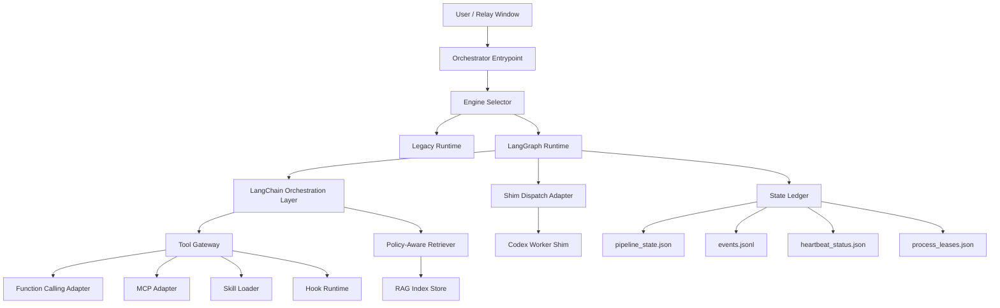
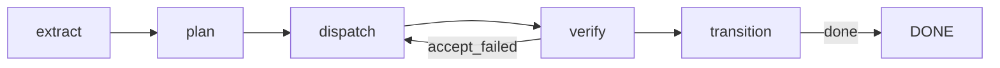

# LangChain + LangGraph + RAG + Codex Integration Design

## 1. Design Summary
This design introduces a dual-engine runtime model where legacy orchestrator remains available and a new LangGraph engine is added in parallel. LangChain is introduced as orchestration glue for tool/retrieval composition, while RAG remains advisory memory with source attribution. Codex worker team execution is integrated through shim-based dispatch with strict artifact capture.

The design is explicitly backward-safe:
- no CLI argument renames/removals
- no `schema_version=1.0.0` semantic break
- no release evidence structure break

## 2. Runtime Topology

## 3. Responsibility Split

### 3.1 LangGraph
- Owns deterministic node execution lifecycle.
- Encodes transition guards and node dependencies.
- Persists transition results into existing ledger contracts.

### 3.2 LangChain
- Provides orchestration glue for tool calling and retriever invocation.
- Applies policy-constrained retrieval and step-scoped tool usage.
- Must emit auditable traces aligned with step/task/run IDs.

### 3.3 RAG
- Supplies contextual evidence for planning/troubleshooting.
- Must include source and relevance metadata.
- Never writes authoritative state directly.

### 3.4 Codex Team Dispatch
- Executes create/resume/rework through shim adapter.
- Emits artifacts (`request.json`, `output.json`, `error.log` style evidence).
- Supports bounded rework loops with strict acceptance checks.

## 4. Node Flow in LangGraph Mode

### Node Details
- `extract`: normalize task/run context and constraints.
- `plan`: retrieve planning context via RAG and build dispatch payload.
- `dispatch`: call shim adapter (Codex worker lane).
- `verify`: run acceptance, audit scope, collect evidence signals.
- `transition`: persist state/event updates and lifecycle summary.

## 5. Engine Selection Strategy

Use non-breaking selection methods:
1. environment variable (e.g., `DAOKIT_RUNTIME_ENGINE=legacy|langgraph`)
2. optional config file key under internal runtime settings

No new mandatory CLI arg is introduced in this batch.

## 6. Compatibility Guardrails
1. CLI parser contract unchanged (command names and existing args preserved).
2. Existing contracts remain parse-compatible and semantically stable.
3. Event type enum remains compatible; extra detail goes into payload.
4. Release evidence directory topology unchanged.

## 7. Rollback Model
1. If LangGraph mode fails acceptance, switch selector back to legacy mode.
2. Preserve same ledger and contracts across both engines.
3. Keep migration-free rollback by avoiding schema forks.

## 8. Validation Strategy
1. Unit tests: engine selection, LangGraph node behavior, LangChain tool/retrieval integration.
2. Integration tests: dispatch path to shim adapter and artifact persistence.
3. Reliability tests: heartbeat/lease/takeover/handoff in LangGraph mode.
4. Compatibility tests: CLI surface invariants, contract invariants, release evidence path invariants.

## 9. Documentation Strategy
- Provide bilingual architecture explanation for LC+LG+RAG collaboration.
- Provide Codex team integration runbook with step-by-step commands and expected evidence.
- Provide portfolio narrative: architecture decisions, operational tradeoffs, and proof artifacts.
