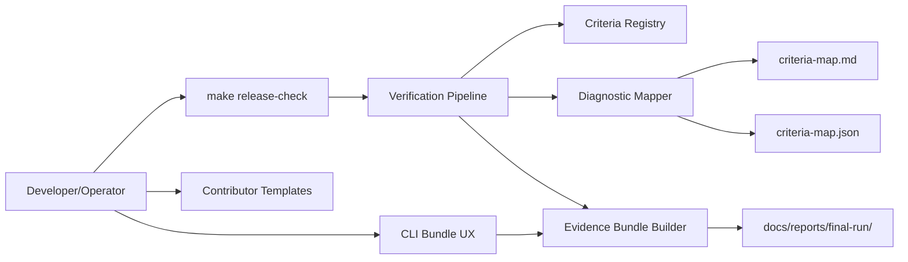

# v1.1 Tooling and Verification Hardening Design

## 1. Design Summary
v1.1 introduces release verification hardening around one deterministic command surface, explicit criterion diagnostics, and contributor templates. The rollout and verification assets are LangGraph-only by policy: legacy runtime path is removed from rollout planning and no public orchestration switch is allowed.

## 2. Target Workflow Topology

## 3. Component Design

### 3.1 Release Check Entrypoint
- Introduce canonical `make release-check` target.
- Define deterministic command order and command-evidence logging contract.
- Emit consolidated pass/fail summary for release gating.

### 3.2 Criteria-to-Diagnostic Mapper
- Maintain criteria registry with stable IDs.
- Map each criterion to diagnostics payload: status, evidence pointers, remediation guidance.
- Export synchronized Markdown and JSON outputs.

### 3.3 CLI Evidence Bundle UX
- Keep existing command names/arguments intact.
- Add additive ergonomics for bundle generation and re-verification flows.
- Enforce compatibility with existing report/evidence anchor paths.

### 3.4 Contributor Template Pack
- Tool adapter template: scaffold + tests + docs checklist.
- Skill manifest template: metadata shape + validation checklist.
- Both templates include release-check verification hooks.

## 4. LangGraph-only Enforcement
1. Rollout docs, tasks, and acceptance matrix reference LangGraph runtime only.
2. Legacy runtime path is explicitly removed from v1.1 rollout planning artifacts.
3. No public parameter-based engine switching appears in v1.1/v1.2 asset set.

## 5. Data and Artifact Contracts
- Criteria diagnostics output:
  - `criterion_id`
  - `status`
  - `evidence_paths`
  - `remediation_hint`
- Verification logs remain command-evidence based (`Command:` and/or command entry markers).
- Evidence structure remains under `docs/reports/final-run/`.

## 6. Verification Strategy
1. Reproducibility checks for `make release-check`.
2. Diagnostic mapping integrity checks (criteria coverage, evidence pointers).
3. CLI bundle generate/re-verify scenario checks.
4. Template smoke checks for contributor onboarding.
5. Compatibility checks for CLI surface, schema semantics, and evidence directory anchors.

## 7. Delivery Plan Mapping
- DKT-038..DKT-046 implement v1.1 hardening in gated waves.
- Parallel work is allowed only inside designated waves with isolated worktrees.
- Wave progression requires merge-to-main and successful push before advancing.
