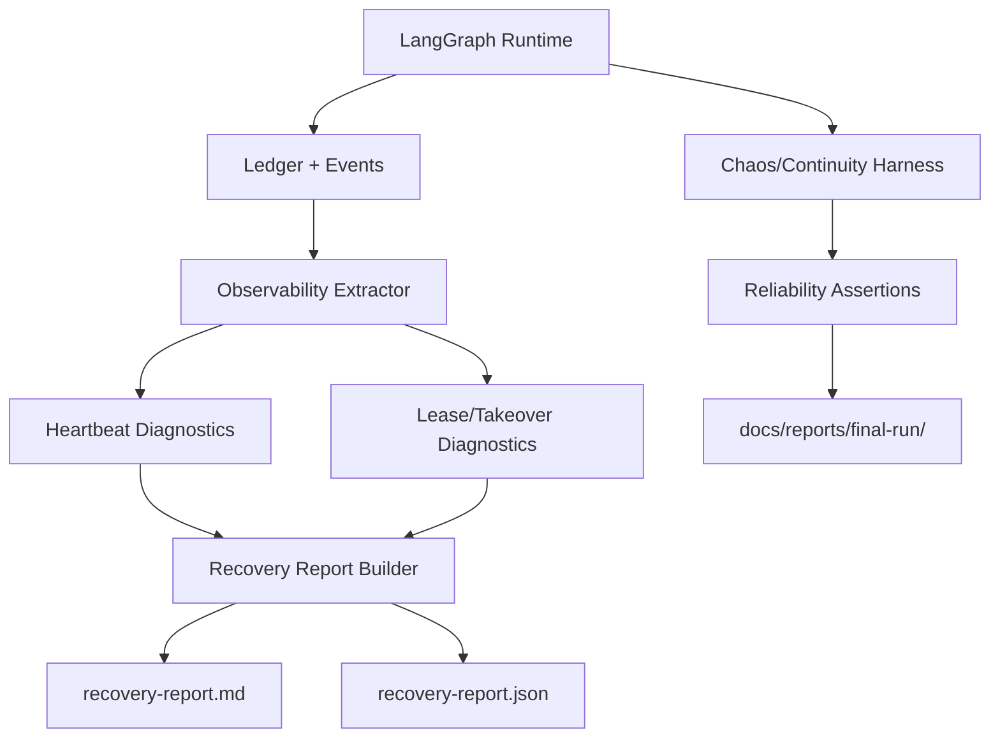

# v1.2 Reliability and Operator Experience Design

## 1. Design Summary
v1.2 hardens operations by making heartbeat/lease/takeover behavior observable, generating operator-oriented recovery reports, and broadening continuity stress verification. All rollout and acceptance artifacts are LangGraph-only; legacy orchestration is removed from rollout planning.

## 2. Reliability Observability Topology

## 3. Component Design

### 3.1 Observability Extractor
- Read ledger/event streams and compute stale heartbeat and lease transitions.
- Attach task/run/step correlation IDs for every diagnosis record.
- Emit deterministic event timeline snapshots for operator review.

### 3.2 Recovery Report Builder
- Aggregate stale detection, takeover timeline, and continuity outcome.
- Emit both Markdown and JSON outputs.
- Preserve evidence linkage to existing final-run directory anchors.

### 3.3 Chaos and Continuity Harness
- Expand core-rotation scenario matrix (timing jitter, stale lease, handoff interruption).
- Assert continuity across takeover/handoff/replay.
- Produce bounded, reproducible long-run reliability evidence.

### 3.4 Guardrail Charter and Acceptance Matrix
- Use `guardrail-charter-acceptance-matrix.md` as the v1.2 source-of-truth for reliability guardrails.
- Encode compatibility invariants and parser-compatible evidence requirements as acceptance gates.
- Anchor v1.2 non-breaking policy to DKT-046 final verification packet outputs.

## 4. LangGraph-only Policy Enforcement
1. Runtime and reliability workflows are documented and validated only for LangGraph orchestration.
2. Legacy path references are removed from v1.2 rollout artifacts.
3. No public parameterized engine-switch guidance exists in v1.2 assets.

## 5. Compatibility Strategy
- Preserve existing CLI command/argument contracts.
- Preserve `schema_version=1.0.0` semantic compatibility.
- Preserve `v1.0.0-rc1` and `docs/reports/final-run/` evidence layout.

## 6. Verification Strategy
1. Observability unit/integration checks for freshness, lease state, and takeover correlations.
2. Recovery report generation checks with known fixture ledgers.
3. Chaos scenario execution checks with continuity assertions.
4. Release gate checks combining reliability outputs and compatibility invariants.

## 7. Delivery Plan Mapping
- DKT-047..DKT-055 implement v1.2 reliability/operator hardening in gated waves.
- Parallel waves are allowed only where dependencies permit isolated worktree execution.
- Each wave requires merge-to-main and successful push before next-wave start.
- DKT-047 freezes guardrails through `guardrail-charter-acceptance-matrix.md` before runtime changes begin.
