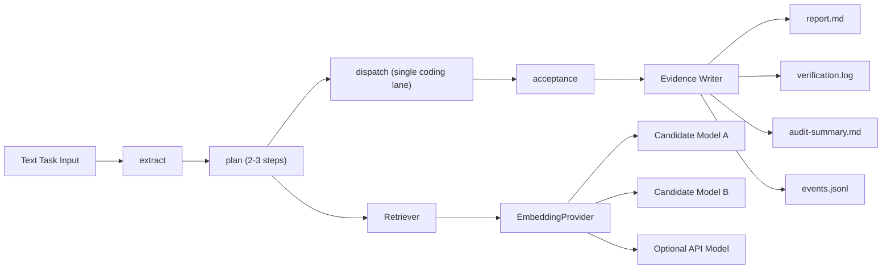

# v1.3 Real Workload Proof Design

## 1. Design Summary
v1.3 implements one minimal but real workload path and upgrades retrieval embeddings to production-grade providers. The design explicitly optimizes for proof value: real execution, auditable flow, constrained scope (P0 + P1 only), and non-breaking compatibility continuity.

## 2. Runtime Topology

## 3. Key Design Decisions

### 3.1 Minimal Scenario Boundary
- Keep a single coding-agent execution lane.
- Keep planner output bounded to 2-3 steps.
- Avoid external GitHub integration as a required dependency.

### 3.2 Reproducibility Semantics
- Reproducibility target is process-level consistency, not bit-for-bit LLM text equality.
- Verification focuses on:
  - transition path consistency,
  - tool-call sequence structure,
  - stable artifact schema/layout.
- LLM text variance is explicitly allowed when process path and artifact-structure checks pass.

### 3.3 EmbeddingProvider Architecture
- Introduce provider interface with explicit production/test modes.
- Production mode: real vector embeddings.
- Test mode: deterministic fixtures for repeatable tests.
- Candidate model selection is deferred to benchmark evidence.

### 3.4 Scope-Freeze Guardrail Mapping (DKT-056)
- `guardrail-charter-acceptance-matrix.md` is the auditable source of truth for:
  - v1.3 scope lock (P0 + P1),
  - v1.4 exclusion in this version (P2/P3),
  - reproducibility semantics and verification methods,
  - runtime/compatibility invariants.
- DKT-056 executes scope freeze and verification only; it does not execute wave integration.

## 4. Data and Artifact Contracts
- `events.jsonl`: complete run trace with step/tool/correlation identifiers.
- `report.md`: human-readable scenario summary.
- `verification.log`: command evidence and verification outcomes.
- `audit-summary.md`: acceptance and risk summary.
- Retrieval benchmark report: top-k quality table and model recommendation.

## 5. Runtime Policy
1. LangGraph is the default runtime mode.
2. Legacy runtime remains maintenance-only and feature-frozen.
3. No new public runtime-switch arguments are introduced.

## 6. Validation Strategy
1. DKT-056 static acceptance checks against scope/reproducibility/compatibility guardrail matrix.
2. E2E scenario tests with real LLM lane and deterministic acceptance checks.
3. Reproducibility checks on transition sequence and artifact structure.
4. EmbeddingProvider unit/integration tests (production vs test mode).
5. Retrieval benchmark execution and result capture in final evidence.
6. Compatibility regression checks for CLI, contracts, and release evidence topology.

## 7. Rollout Mapping
- Wave 0: Scope and acceptance freeze.
- Wave 1: Minimal scenario implementation.
- Wave 2: EmbeddingProvider + benchmark + default-model decision.
- Wave 3: Final verification, merge, and `v1.3.0` tagging readiness.
- Wave 0 (DKT-056) excludes wave-integration operations and implementation of v1.4 P2/P3 items.
