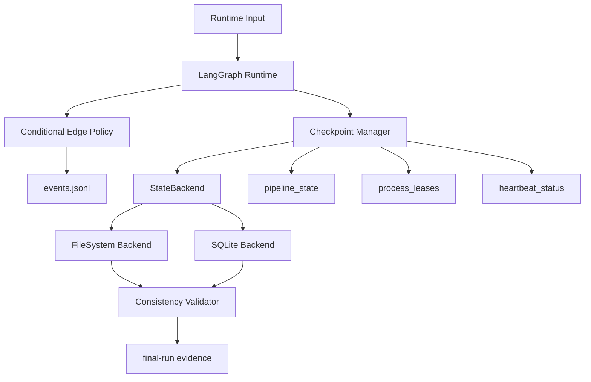

# v1.4 Deep Integration Design

## 1. Design Summary
v1.4 deepens two architecture axes only: LangGraph orchestration depth and pluggable persistence. The design intentionally excludes lower-priority expansions to keep delivery focused.

Scope boundary for v1.4 is fixed:
- P2 only: conditional edges + checkpoint/resume.
- P3 only: `StateBackend` + SQLite backend parity.
- Explicitly excluded: parallel branches and human-in-the-loop.

## 2. Runtime Topology

## 3. Component Design

### 3.1 Conditional Edge Policy
- Encapsulate route decisions with explicit predicates.
- Attach deterministic reason codes to each route branch.
- Enforce route-guard failure handling with clear diagnostics.

### 3.2 Checkpoint Manager
- Persist checkpoints at extract/plan/dispatch/verify/transition boundaries.
- Validate checkpoint integrity before resume.
- Support replay-safe resume semantics.

### 3.3 StateBackend Interface
- Define unified operations for:
  - pipeline state,
  - events append/read,
  - lease state,
  - heartbeat status,
  - checkpoint records.
- Keep FS backend as reference implementation.
- Add SQLite backend with equivalent behavior.

### 3.4 Consistency Validator
- Run same scenario across FS and SQLite.
- Compare state/event equivalence at contract-relevant fields.
- Emit structured consistency report into release evidence.

## 4. Runtime Policy
1. LangGraph is the default runtime path.
2. Legacy runtime remains maintenance-only and unchanged for new features.
3. Backend selection stays internal and compatibility-safe.
4. Public CLI names/args and contract anchors remain unchanged while v1.4 internals evolve.

## 5. Verification Strategy
1. Unit tests for route predicates and checkpoint manager.
2. Integration tests for resume path correctness.
3. Backend parity tests across FS and SQLite.
4. Reliability-focused consistency tests including recovery-related scenarios.
5. Compatibility tests for CLI/contracts/release evidence topology.

## 6. Rollout Mapping
- Wave 0: Scope and invariant freeze (documentation + acceptance matrix only).
- Wave 1: Conditional routing + checkpoint/resume implementation.
- Wave 2: StateBackend abstraction + SQLite backend + parity validation.
- Wave 3: Final verification, merge, and `v1.4.0` tagging readiness.

## 7. Scope Guardrail Linkage
1. DKT-064 guardrail source of truth: `specs/007-v1-4-deep-integration/guardrail-charter-acceptance-matrix.md`.
2. Scope boundary and out-of-scope checks in this design must stay aligned with:
   - `specs/007-v1-4-deep-integration/requirements.md`
   - `specs/007-v1-4-deep-integration/tasks.md`
   - `docs/roadmap.md`
   - `v1.3规划.md`
3. Compatibility/runtime invariants encoded in DKT-064 are unchanged from v1.3:
   - CLI surface unchanged,
   - `schema_version=1.0.0` semantics unchanged,
   - `v1.0.0-rc1` and `docs/reports/final-run/` anchors unchanged,
   - LangGraph default + legacy runtime maintenance-only.
